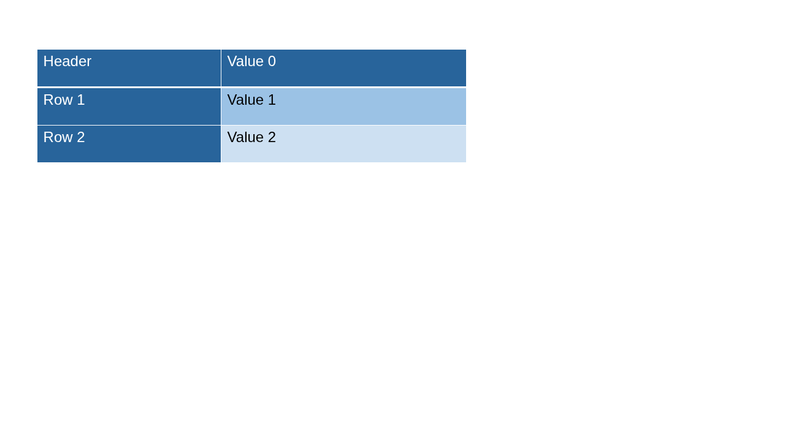
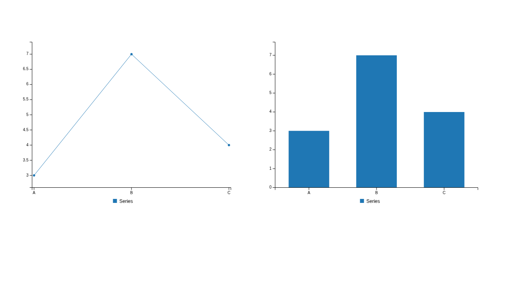
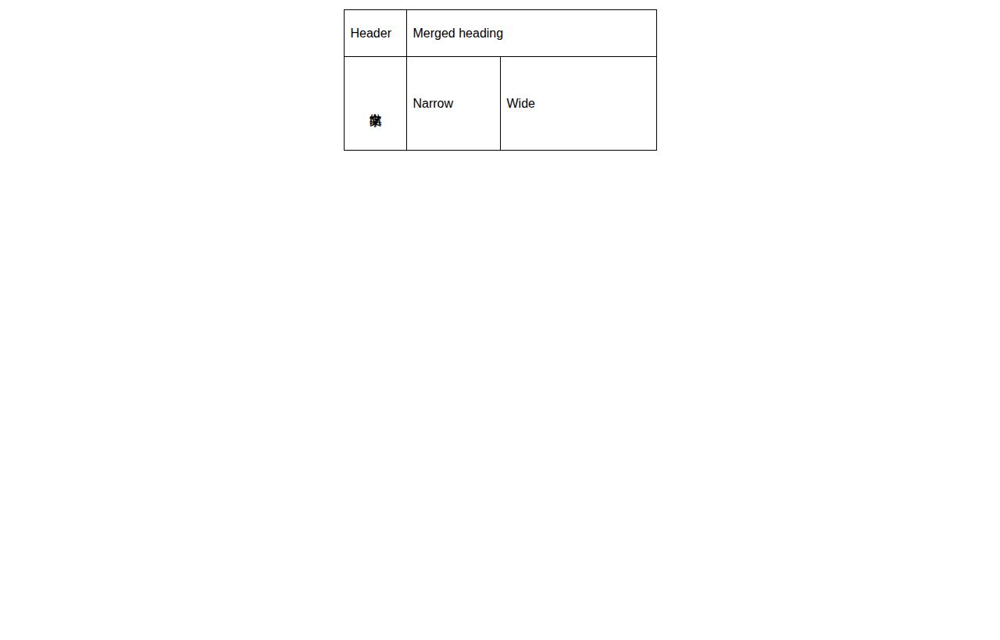
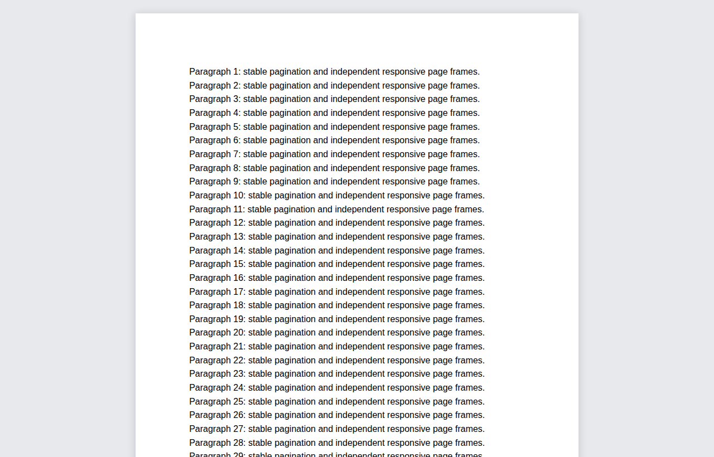

# 渲染兼容性修复记录

## 变更范围

| 范围      | 根因                                                                                     | 修复                                                                                                   |
| --------- | ---------------------------------------------------------------------------------------- | ------------------------------------------------------------------------------------------------------ |
| DOC 表格  | `vertical-align:center` 是无效值；表格居中设置被缩进覆盖；首行合并单元格触发等宽分配     | 使用 `middle`，保留表格对齐与实际列网格，恢复竖排 CJK 内容，移除宿主对列布局及空白处理的强制覆盖       |
| DOCX 分页 | 布局等待预算耗尽后，引擎仍可能继续分页；预览层提前移动页面，破坏引擎要求的直接子节点结构 | 监听分页状态，在完成后创建独立页面容器；卸载时停止观察                                                 |
| PPTX 表格 | 表格缺少闭合标签，后续页面被嵌套；默认样式未解析；部分边框继承路径不完整；列样式串用     | 闭合表格，支持默认样式与 Medium Style 2 的六种强调色，优先显式样式，未知样式不猜测，逐单元格重置列样式 |
| PPTX 图表 | 图表库改写宿主定位，且 SVG 折线缺少必要样式                                              | 独立图表绘制子容器，保留外层坐标，提供预览器内的图形与提示框样式                                       |
| Markdown  | 标题未生成锚点，目录跳转依赖宿主页                                                       | 生成唯一标题 ID，限定当前文档解析与滚动，保留原有 ID 与修饰键行为                                      |
| PDF       | 缺少可配置的鼠标拖拽阅读方式                                                             | 增加 `options.pdf.handTool`，默认关闭；保护链接、表单、触摸操作并完整清理事件                          |

## 自动验证

- `pnpm test:compatibility`：28 项解析、模型及 DOM 检查。
- `pnpm verify:compatibility-browser`：上述 28 项加 8 项真实 Chromium 检查，共 36 项。
- 浏览器检查包括实际图表库绘制、Markdown 解析与导航、拖拽及控件保护、DOC 布局、实际 DOCX 引擎的异步分页与卸载。
- 自动生成最小 OOXML 和表格模型；没有引入额外运行时依赖或修改版本、锁文件。

## 验证边界

DOC 表格对齐、列宽及竖排和 PPTX 的 9 页结构、9 个图表、3 个表格另外完成了实际文件复测。
DOCX 分页容器竞态已复现并验证，但这不等同于所有文档的页数、页脚和打印效果均与 Word 一致。
DOC 竖排目前处理 `textFlow=5`；未知表格预设不会补造样式。PDF 浏览器自动测试针对交互控制器，
不是完整 PDF.js 文件加载验收。没有将这批检查当作全仓库发版验收。

## Issue 处理范围

#321 的配置式拖拽已实现。#312 的表格结构、边框、折线及多图位置已修复。
#323 的表格结构性偏差已修复，未作字体级像素一致性承诺。#322 的分页容器竞态已修复，
页脚和全部分页场景仍需逐项验收。#311 已有源码修复，未重复修改或发布新版本。
本分支不自动关闭 issue，不创建 PR，不修改 main。

## 最小回归截图

## 回退

回退本次功能提交即可；没有数据迁移。关闭 PDF 手形工具可恢复原有交互。
