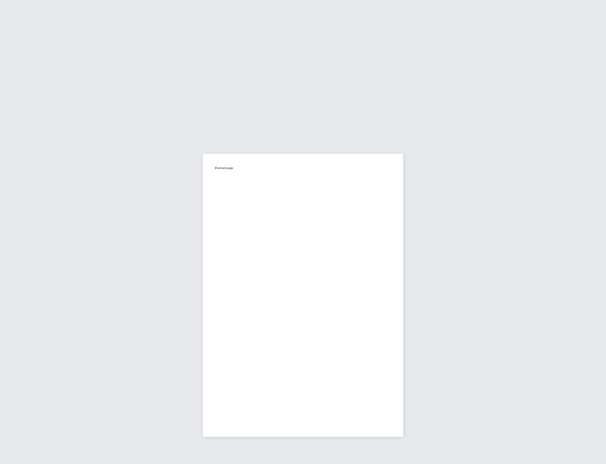
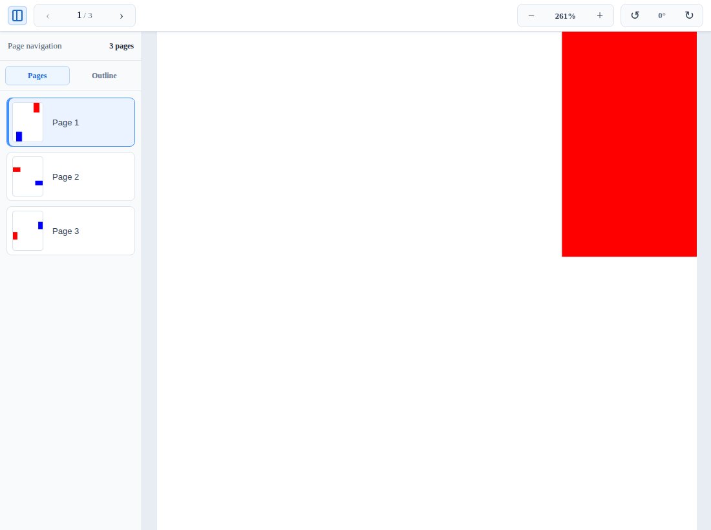
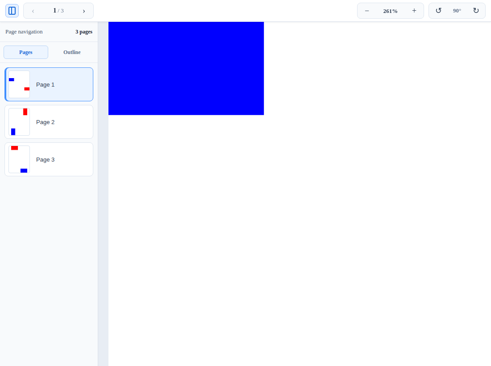
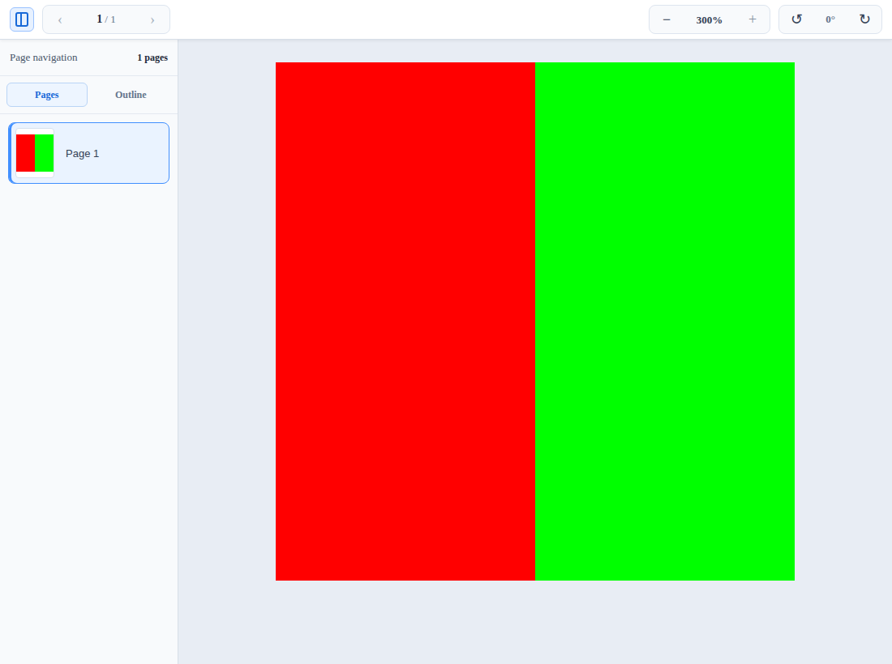

# 打印与页面方向验证结果

已验证功能提交：`b88e774ec00aa33a0037005c5d3288658366ce2a`。

| 检查 | 结果 |
| --- | --- |
| 新增输出兼容性检查 | 39 项通过：27 项解析/DOM/就绪检查和 12 项 Chromium 检查 |
| 上一轮兼容性回归 | 36 项通过 |
| Core、DOC、PPTX、Word、PDF、Text 构建及类型检查 | 6 个包通过，使用实际依赖 |
| Word 既有包内测试 | 20 项通过 |
| Text 既有包内测试 | 23 项通过 |
| PDF 运行资源校验 | 通过，包含已声明的 PDF.js 修补 |

结果见 [report.json](report.json)、[previous-report.json](previous-report.json)
和 [verification.json](verification.json)。验收运行编号为 `35697699063`。

打印检查读取 Chromium 实际生成的 PDF，以 1 pt 容差比对逐页纸张尺寸，并拒绝
额外空白页；不是只判断样式字符串。JPEG2000 检查验证本地 `openjpeg.wasm`
请求成功，并读取画布红色和绿色区域的实际 RGBA 像素。

## 浏览器截图

Canvas 原图与导出图显示盒、位置和变换一致：

DOCX 混合纸张；物理尺寸见 [docx-mixed-paper.json](docx-mixed-paper.json)：

PDF 原始旋转与用户旋转，纸张尺寸分别见
[pdf-rotation-0.json](pdf-rotation-0.json) 和 [pdf-rotation-90.json](pdf-rotation-90.json)：

## 验证边界

此轮使用隔离的真实依赖安装和相关包构建，并非完整 workspace 冻结锁发版验证。
DOCX/PDF 浏览器测试运行实际引擎，没有解析器替身；字体就绪和异常等待中的
边界时序由确定性测试覆盖。打印驱动覆盖设置及全部 Office 文档的像素保真不在
此组测试的承诺范围内。
