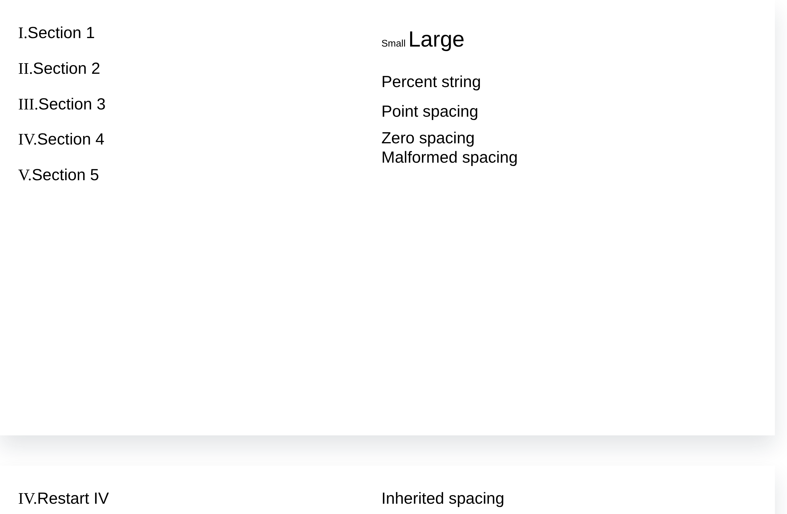

# PPTX 编号方案与段落间距修复

## 根因和修复

- 自动编号仅实现部分阿拉伯数字、字母方案；罗马数字退化为普通数字，字母超过 Z 后亦错误。现保留大小写、句点、括号和明确的 startAt，正确递增；无效起始值不作为重启指令，未知方案保持原回退。
- `spcBef`/`spcAft` 只读取点数，百分比设置被忽略。现按最大有效文字运行字号计算百分比，保留小数像素；支持数值及百分号形式，保留直接样式、列表、版式和母版继承中的明确零值及点数覆盖。
- 含几何图形的文字占位符被当成普通 shape，失去所属文字样式继承。现保留明确的占位符类型，并兼容版式中单个段落及列表样式，修正继承的固定行距查找路径。

功能提交：`088a0dcb`。修复位于 PPTX 包自己的解析和文本后处理层，没有按文件名、哈希或正文特判，没有新增运行时依赖、版本号或公共接口变化。

## 验证

```bash
pnpm --filter @file-viewer/pptx build
node packages/renderers/pptx/scripts/verify-github-176.mjs
node packages/renderers/pptx/scripts/verify-github-268.mjs
node packages/renderers/pptx/scripts/verify-paragraph-numbering.mjs
```

设置 `PPTX_PARAGRAPH_CORPUS_DIR` 指向包含 `C050.pptx` 的本地目录可追加原样验收。11 项生成式/行为检查加 1 项原样检查，共 12 项通过。旧代码在首项中将 I–V 显示成 1–5，修复后正确。混合字号、百分号写法、明确零值、固定点数、无效百分比、继承、编号重启和重复后处理均检查。

C050 原稿五个编号恢复为 `I.` 至 `V.`，每段前后间距均为有效字号的 50%；两段以上文字运行不再造成字号度量丢失。远端 Core/PPTX 构建和既有连接线、图表回归通过，运行编号 `35818968969`，记录位于 `evidence/pptx-paragraph-20260923/`。



## 验收边界

本次结清的是已复现的目录编号、百分比段距及占位符继承子项，不是 P01 全部版式。原稿字体、全部对齐、母版层次、掩码透明度和动态页码等仍需逐元素验收。编号的复杂多级重启、其他特殊脚本编号不由本组结论外推。额外本地 12 份 PPTX/60 页解析及文本后处理复测不等于图表绘制或整页像素保真。

可单独回退本次功能提交；原件未修改，没有数据迁移。本次未创建 PR、合并 main 或发布 npm 包。
