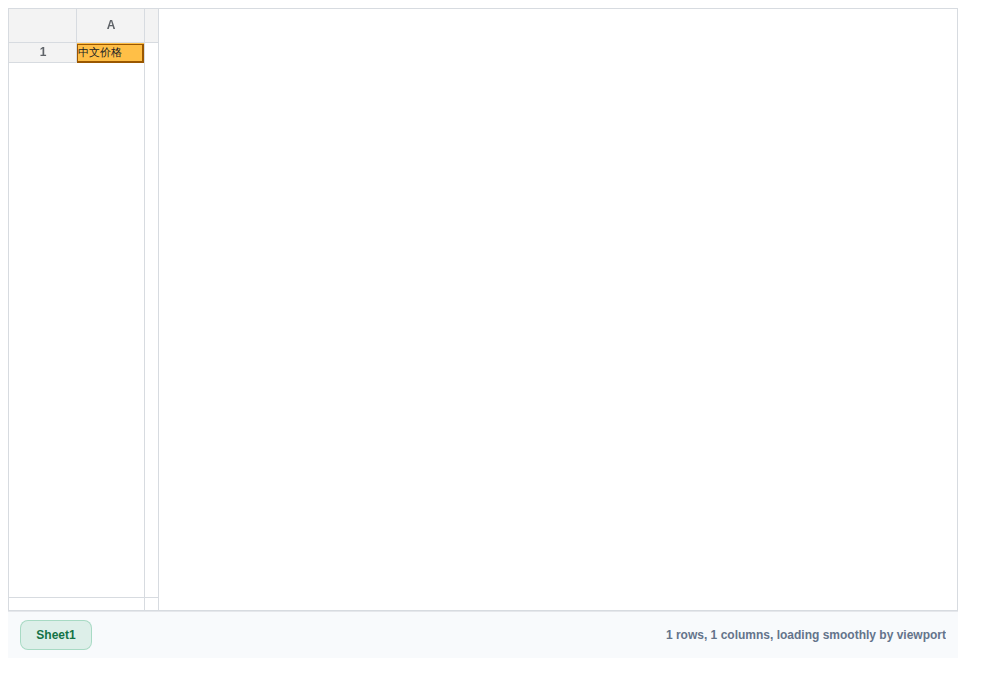

# 旧 Excel 文本容器解码修复

## 根因与修改

部分 `.xls`、`.xlt`、`.xla` 文件实际包含 UTF-8、UTF-16、GBK 文本或 HTML 表格，
不是 BIFF 工作簿。此前只有 CSV/TSV 进入共享文字解码器；旧 Excel 后缀下的文字
被以单字节方式读取，导致中文乱码。现在对旧 Excel 输入作有界内容识别，确认文字后
使用共享解码器，再交给原工作簿解析器读取，不改写原文件或凭后缀生成替代数据。

OLE、ZIP、原始 BIFF BOF、二进制控制数据、奇数长度 UTF-16 和无关 PDF/RTF
保持原二进制路径。现代工作簿和未知类型不扩大文字嗅探范围。CSV/TSV 原有行为保留。

## 验证

执行 `pnpm --filter @file-viewer/renderer-spreadsheet build`，然后执行
`node packages/renderers/spreadsheet/scripts/verify-text-containers.mjs`。

18 项检查包括 15 项真实解析/编码检查和 3 项 Chromium 检查；浏览器执行实际
renderer、单元格检索与独立 classic Worker，没有以主线程回退替代 Worker 结果。
真实 OLE/XLSX 以及已存在的异常维度、富文本回归也通过。

原样 C032 解码后的单元格已与原 UTF-8 内容一致；C006 的 3 行 4 列 CSV 保持正确，
后者不记作本轮新增修复。原稿校验见 `evidence/spreadsheet-text-20260922/original-checks.json`。

## 范围与回退

此轮处理内容识别和文字编码，不代表 Excel 图表、全部样式、拖拽交互或所有宿主
已完成验收。Worker 检查执行同一打包产物的 classic 路径，未将其当作全部模块加载
环境的验收。无运行时依赖和数据格式迁移，可单独回退本轮提交。
